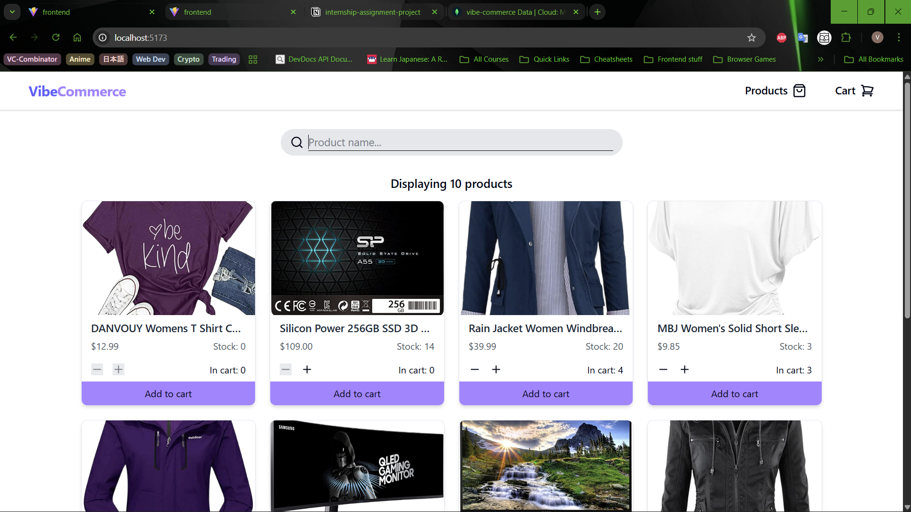
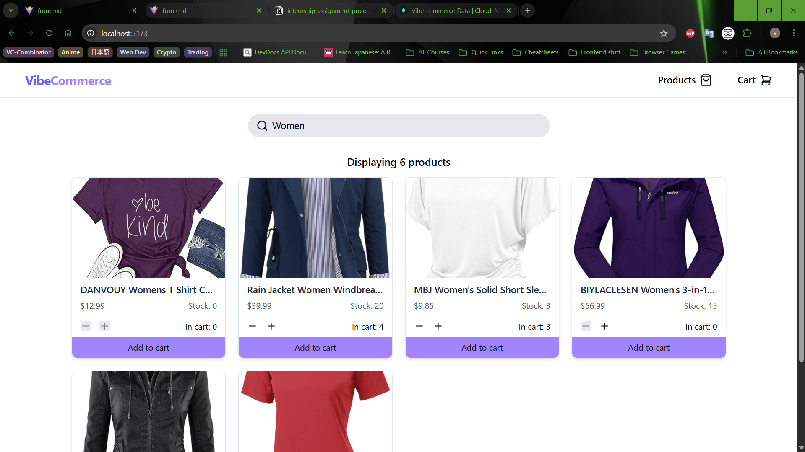
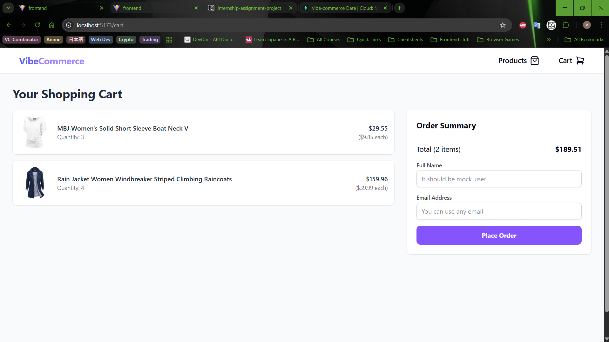
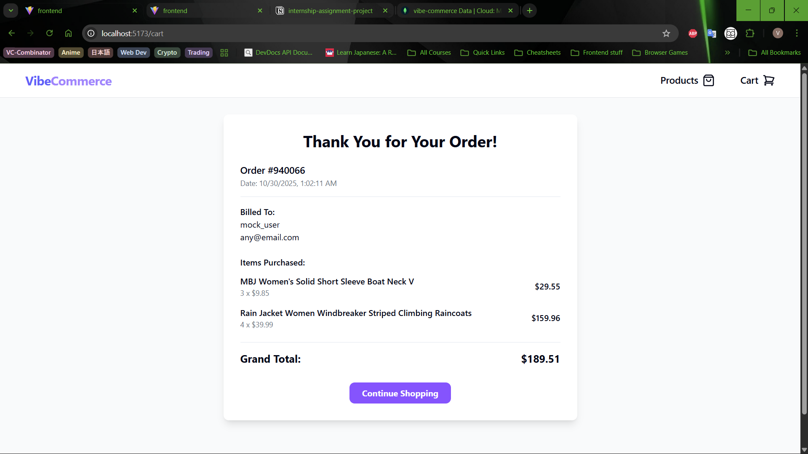
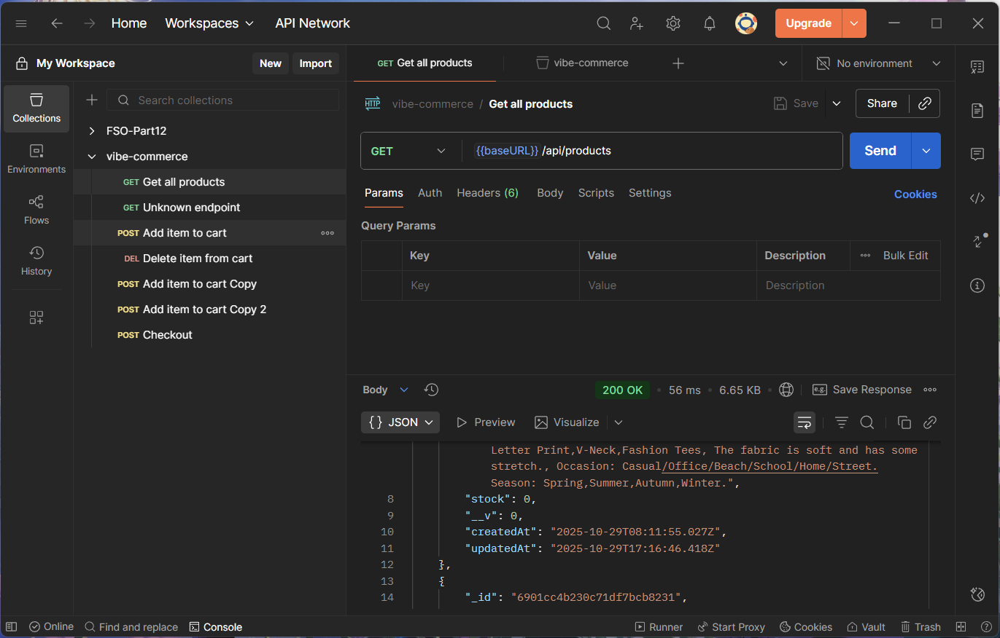
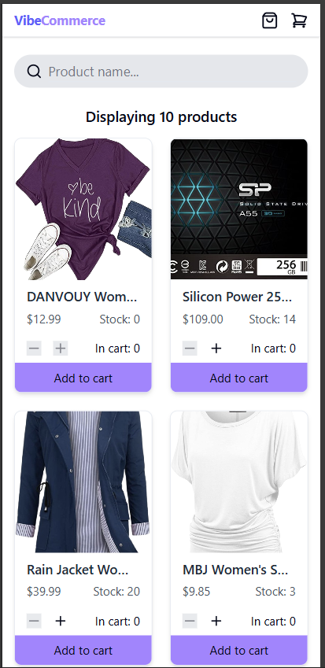
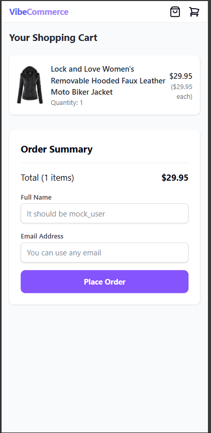
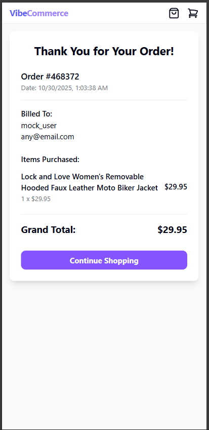

# Vibe Commerce

Submitted by - Vikramjit Singh Gill

Vibe Commerce is a full-stack e-commerce application built with the MERN stack (MongoDB, Express, React, Node.js). It features a complete shopping cart flow, from browsing products to a mock checkout process. This project was developed as a screening assignment to demonstrate proficiency in building modern web applications.

## ✨ Features

*   **Product Catalog:** Browse a grid of products fetched from the backend.
*   **Search:** Filter products by name (uses client side search, no page reloads).
*   **Shopping Cart:** Add, remove, and update item quantities in the cart.
*   **Mock Checkout:** Enter name as "mock_user" and any email to receive a mock receipt.
*   **Responsive Design:** Fully responsive design for both desktop and mobile devices.
*   **REST API:** A well-defined API for managing products, cart, and checkout, tested with Postman.

### 🚀 Bonus Features

*   **Database Persistence:** The shopping cart is tied to a `mock_user`, so the cart's state is saved and will persist across sessions.
*   **Robust Error Handling:** Built with many areas of error handling on both the client and server.
*   **Fake Store API:** When you initialize the backend, you can do `node seedDatabase.js` in the backend directory, which will fetch data from Fake Store API and populate the database with 10 items by default.

### Note - I'm using the latest version of express, where if you throw any error on any async route, express will automatically catch it with the error handler middleware. That is why you'll see me either not catch error or throw it deliberately, since I have the middleware set up.

## 📸 Screenshots

### 💻 Desktop
<div align="center">
  <h3>Homepage</h3>
  <br><br>
  <h3>Search</h3>
  <br><br>
  <h3>Cart</h3>
  <br><br>
  <h3>Checkout Receipt</h3>
  <br><br>
  <h3>Backend API Testing</h3>
  
</div>

---

### 📱 Mobile Views
<div align="center">
  <h3>Homepage | Cart | Checkout Reciept</h3>
  
  
  
</div>

## 🛠️ Tech Stack

*   **Frontend:** React, Vite, Tailwind CSS, Shadcn, Axios
*   **Backend:** Node.js, Express.js
*   **Database:** MongoDB (with Mongoose)

## 🚀 Getting Started

### Prerequisites

*   Node.js (v14 or later)
*   npm
*   MongoDB

### Installation

1.  **Clone the repository:**
    ```bash
    git clone https://github.com/your-username/vibe-commerce.git
    cd vibe-commerce
    ```

2.  **Backend Setup:**
    ```bash
    cd backend
    npm install
    cp .env.example .env
    # Add your MongoDB connection string to the .env file
    npm run seedDatabase
    npm run dev
    ```

3.  **Frontend Setup:**
    ```bash
    cd ../frontend
    npm install
    npm run dev
    ```

## API Endpoints

### Products

*   `GET /api/products`: Get all products.

### Cart

*   `GET /api/cart`: Get all cart items for the mock user.
*   `POST /api/cart`: Add an item to the cart.
    *   **Body:** `{ "productId": "...", "quantity": <number> }`
*   `DELETE /api/cart/:id`: Remove an item from the cart.

### Checkout

*   `POST /api/checkout`: Process the checkout.
    *   **Body:** `{ "name": "mock_user", "email": <any email> }`

## Details
- The frontend utilized Shadcn mainly for icons. I had intended on using it a lot of the UI but I was on a time constraint so I instead went for a minimalistic look and manually styled the components.
- I tried to use all the backend features that had been implemented. Example - in the updateCart function in ProductsGrid.jsx, we first delete the previous entry of the current item we're putting in the cart to make sure there is no mismatch in the cart contents in the frontend and the backend
- The entrypoint of the backend is index.js but the express app is initialized and exported in app.js, I used this pattern because firstly, separation of concerns, and mainly because I have experience with unit and integration testing with jest and supertest, and libraries like supertest actually recommend this pattern, because with this we can directly import the express app into supertest and it can bind it to an ephemeral port which greatly speeds up the init process and testing
- I manually created an error logging middleware because importing something like morgan felt like overkill
- I am aware some of the frontend components are too big, especailly with all the tailwind and can be broken down into smaller pieces, but I was short on time so I prioritized improving the style over compartmentalizing, since I believe the end users experience matters more than the code related details.
